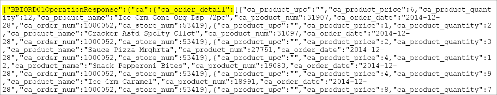
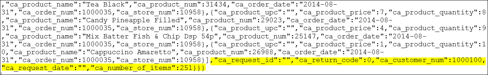

# IBM Watson Analytics on Breadbox Customer Purchase History

In this section, you will explore and gain insights from Breadbox Groceries customer purchase history. This data exploration can have immense business value, looking for trends, such as products selling well, not so well, for specific customers, trends in customer retention, customer purchase volume per visit, customer visits to more than one store – the possibilities are endless.  Armed with insights, Breadbox Groceries might use the Virtual Shopping List mobile application to insert promotions to target customers, that might improve number of visits, quantity of purchases per visit, etc.  After the promotion period, the results can be measured by further analytics on customer purchase history.  In this section, we’ll use the API we created, to gather customer purchase history for various customers, feed that information into IBM Watson Analytics, running in the IBM Cloud, to see what types of insights are possible.

## 1. Gather, format Breadbox customer purchase history
 
In the first Experience, we saw that the customerHistory API returns a large json document.  The API returns data for a single customer.  One tricky part is that IBM Watson Analytics doesn’t process json, so you will have to convert the API json response to CSV format. 

If you prefer to use a prepared CSV file and skip this step, please download [result.csv](https://github.com/IBM/Increasing-retail-store-revenues-leveraging-zSystem-hybrid-cloud/blob/master/Sample%20code/result.csv) from the **Sample code** github repository. This file contains purchase history for customer 1000100. 
 
1. Retrieve customer history for a customer.

   There are a number of tools, techniques to do an API request.  Using curl is shown here.

   ``` 
   curl --request GET \
     --url 'https://api.us.apiconnect.ibmcloud.com/spbodieusibmcom-prod/developer-contest/breadbox /customerHistory?customer_number=1000100&request_date=2013-09-01' \
     --header 'accept: application/json' \
     --header 'x-ibm-client-id: df2fecbf-01f5-41ed-90c0-2b8883db2a3b' \
     --header 'x-ibm-client-secret: -----------------------------------------'
   ```
   
2. Convert results from json to csv format.

   This command will return results in json format. There likely are several ways to convert json to csv.  A simple google search often finds a good candidate.  

   >IMPORTANT:  One slightly hidden step is to trim the json response to only the details portion of the response (ca_order_detail), the main part of the response, the long array of strings, between the square brackets:  [  … ].  The vi editor is used to remove the front and back matter, to leave the square brackets and everything in between.  

   

   

## 2. Login to IBM Watson Analytics, upload data

1. Login to [IBM Watson Analytics].

2. Use your IBMid to login. You will have to sign up for a free trial if you have done done so already.

   

   

3. Click New data in the upper left.

   

4. Click Local file and click Browse.

   

   
 
5. Select your .csv file using your OS file chooser.

6. Click Import in the bottom left.

   
 
7. Click the tile for the .csv file just uploaded.

   
 
 
## 3. Generate Insights

Various Starting points are shown.  You can begin your data exploration, trying out various things you see, and see what you can come up with.
 

 
Here are a few examples.

This customer really likes Honeyed Preserve.
 
This customer buys mostly in Store 4 and 5, and really likes Tea Lemon Ginger.

This customer is spending more lately  ;-)
 
  
[IBM Watson Analytics]: https://www.ibm.com/analytics/watson-analytics/us-en/
