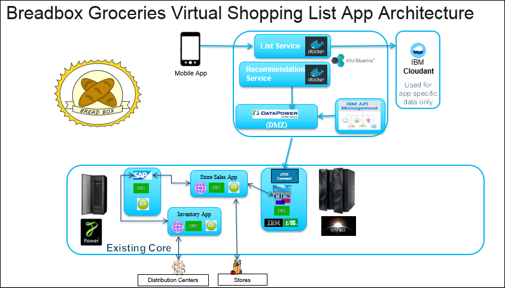
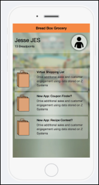

# Increasing retail store revenues using IBM Z hybrid cloud
## Overview

To showcase the business challenges that a typical retail company might be experiencing, we share a case study about a fictitious retail company, which we refer to as **Breadbox Groceries**.  

Today, they run three data centers across the country with IT reaching into the stores and distribution centers as well.  In the data centers, they host their core Business Support Systems on IBM Z. Supporting applications are hosted on IBM CICS® and IBM z/OS® Db2 systems.

One of the initiative for Breadbox was to implement the **virtual shopping list**. With this app, customers will be reminded that they need milk at the store the next time they go based on the purchasing history. 

## Architecture

This diagram shows the Virtual Shopping List mobile application and two supporting microservices or web services: The Virtual Shopping List List Web Service (vsl-list-ws) and the Virtual Shopping List Recommendation Web Service (vsl-rec-ws).  

* The Recommendation Service is a simple recommendation engine, that finds patterns in customer’s purchases, mostly around durations between purchases, and makes recommendations for new purchases.  

* The List Service supports the mobile phone app (breadboxportal), by managing and persisting the list seen on the mobile phone app, merging in customer added items with customer selected recommendations.  

App users can add or ignore recommendations, can enter free form items, and can delete items at any time.  List Service has the smarts, and uses a  Cloudant database behind it, to maintain the current list.

## Scenarios

**Part one:** Use the API Connect Developer Portal to test the **GET /customerHistory** operation.  This operation retrieves customer purchase history.  It will be used in Part two of this journey.   

**Part two:** Deploy the Virtual shopping list mobile application and associated web services in IBM Bluemix.

## Included components
  
* [IBM Z Mainframe] ([IBM Z Mainframe Redbook] & [IBM Z Mainframe developerWorks])
* [IBM z/OS] ([IBM z/OS Knowledge Center])
* [IBM CICS Transaction Server] ([IBM CICS TS Knowledge Center] & [IBM CICS TS developerWorks])
* [IBM z/OS Connect Enterprise Edition] ([IBM z/OS Connect EE Knowledge Center] & [IBM z/OS Connect EE developerWorks])
* [IBM Db2] ([IBM Db2 Knowledge Center])
* [IBM Bluemix]
* [IBM API Connect] ([IBM API Connect Knowledge Center] & [IBM API Connect developerWorks])
* [IBM Cloudant]

# Part one:  Test Breadbox API 
Use the API Connect Developer Portal to test the **GET /customerHistory** operation of the Breadbox API.  This operation retrieves customer purchase history and will be used in Part two of this journey.   

1. Sign up for an [IBM ID] if you don't have one already. This is required for the next step.
2. Go to the [IBM Developer Portal].
3. Create an account if you have not done do already.

   
   
   * Click **Create an account**.
   * Fill out the information.  Be sure to use your IBM ID for this account.
   * Click **Submit**.
   
   You will receive an account activation email. You need to click on the link in this email to activate your account before you can login. 
   
4. Login to your account. 

5. First, you must create a new application (your work space for this project).  

   
   
   * Click **Apps** from the menu. 
   * Click **Create new app**. 
   * Fill in all required fields. 
   * Click **Submit**.
   
   Make a note of your client ID and client secret. You will need them to access the API later. 
   
   
     
6. Display a list of available API products.
   * Click **API Products** from the top menu.
        
   
   
7. You will be working with the **Breadbox** product.
   * Click **Breadbox**. 
   
   
   
   From the left navigation panel, you will see one published API named **breadbox team dinosaur**.

8. In order to work with this API, you must subscribe to it first.
   * Click **Subscribe** for the Default Plan.
   * Select the app that you have just created.
   * Click **Subscribe**
   
   
   
   
9. Let's take a closer took at this API. 
   * Click **breadbox team dinosaur**.
   
   
   
   This page has 3 sections:
   * The left panel is the navigation panel that lists all the available operations and their definitions.
   * The middle panel displays detail information for the item you have selected.
   * The right panel contains sample code in various programming languages.    
  
10. This API has one operation **GET /customerHistory"**.  
    * Click **GET /customerHistory"**.
    
    
    
    This operation retrieves purchase history for a customer. The required parameters and their formats are described.
  
11. Generate code to test this operation.  Go to the right panel.
    * Click a programming language that you want to work with.
    
    
    
    Code example in the selected programming language and an example output of a successful response are displayed.  You can copy the code and use it in your own application. 
    
    
    
12. Test the **GET /customerHistory"** operation with the generated code.    
    * Scroll down to **Try this operation** section.  Fill in the following:
    
      | Field           | Value                      | Comment                                         |
      | --------------- | -------------------------- | ----------------------------------------------- |
      | Client ID       | ID of the application      | Should be defaulted to the one you just created |
      | Client secret   | Secret for the application | Secret generated when app was created           |       
      | customer_number | 1000100                    | Validate #s are 1000100-1000???                 |        
      | request_date    | 2013-09-01                 | Purchase history since this date                |        
      | shorten         | 2                          | Number of records to retrieve                   |       
       
    * Click **Call operation**.
    
    
    
    You should see the output returned at the bottom of the page.
    
    

:thumbsup: Congrtulations!  You have successfully tested the Breadbox API that ready to move on to part 2 of this journey.

# Scenario two: Deploy Virtual Shopping List application

1. Sign up for a Bluemix account, if you don't have one already.

2. Sign up 

[IBM Digital Transformation Model]: https://developer.ibm.com/mainframe/ibm-digital-transformation/

[IBM Bluemix]: https://www.ibm.com/us-en/marketplace/cloud-platform
[IBM Z Mainframe]: https://www-03.ibm.com/systems/z/

[IBM Z Mainframe Redbook]: https://www.redbooks.ibm.com/redbooks.nsf/pages/z13?Open
[IBM Z Mainframe developerWorks]: https://developer.ibm.com/mainframe/

[IBM z/OS]: https://www-03.ibm.com/systems/z/os/zos/
[IBM z/OS Knowledge Center]: https://www.ibm.com/support/knowledgecenter/en/SSLTBW

[IBM CICS Transaction Server]: https://www-01.ibm.com/software/data/enterprise-application-servers/cics/
[IBM CICS TS Knowledge Center]: https://www.ibm.com/support/knowledgecenter/en/SSGMGV
[IBM CICS TS developerWorks]: https://developer.ibm.com/cics/

[IBM z/OS Connect Enterprise Edition]: https://www.ibm.com/ms-en/marketplace/connect-enterprise-edition
[IBM z/OS Connect EE Knowledge Center]: https://www.ibm.com/support/knowledgecenter/en/SS4SVW
[IBM z/OS Connect EE developerWorks]: https://developer.ibm.com/mainframe/products/zosconnect/

[IBM Db2]: https://www.ibm.com/analytics/us/en/technology/db2/?lnk=STW_US_SHP_A4_TL&lnk2=learn_DB2
[IBM Db2 Knowledge Center]: https://www.ibm.com/support/knowledgecenter/en/SSEPEK/db2z_prodhome.html

[IBM API Connect]: http://www-03.ibm.com/software/products/en/api-connect
[IBM API Connect Knowledge Center]: https://www.ibm.com/support/knowledgecenter/en/SSMNED 
[IBM API Connect developerWorks]: https://developer.ibm.com/apiconnect/

[IBM ID]: https://www.ibm.com/account/us-en/signup/register.html
[IBM Developer Portal]: https://developer-contest-spbodieusibmcom-prod.developer.us.apiconnect.ibmcloud.com/

[Sign up or log in to IBM Bluemix]: https://console.bluemix.net/registration/?

[IBM Cloudant]: https://www.ibm.com/analytics/us/en/technology/cloud-data-services/cloudant

