# Increasing retail store revenues using IBM Z hybrid cloud
## Overview

To showcase the business challenges that a typical retail company might be experiencing, we share a case study about a fictitious retail company, which we refer to as **Breadbox Groceries**.  

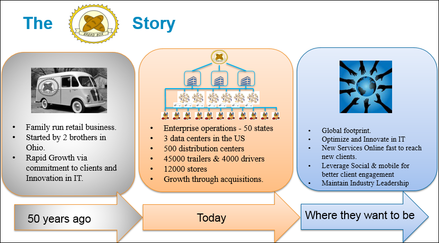

Today, they run three data centers across the country with IT reaching into the stores and distribution centers as well.  In the data centers, they host their core Business Support Systems on IBM Z. Supporting applications are hosted on IBM CICS® and IBM z/OS® Db2 systems.

One of the initiative for Breadbox was to implement the **virtual shopping list**. With this app, customers will be reminded that they need milk at the store the next time they go based on the purchasing history. 

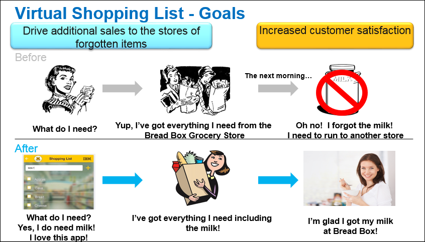

## Architecture 

This diagram shows the Virtual Shopping List mobile application and two supporting microservices or web services: The Virtual Shopping List List Web Service (vsl-list-ws) and the Virtual Shopping List Recommendation Web Service (vsl-rec-ws).  

* The Recommendation Service is a simple recommendation engine, that finds patterns in customer’s purchases, mostly around durations between purchases, and makes recommendations for new purchases.  

* The List Service supports the mobile phone app (breadboxportal), by managing and persisting the list seen on the mobile phone app, merging in customer added items with customer selected recommendations.  

App users can add or ignore recommendations, can enter free form items, and can delete items at any time.  List Service has the smarts, and uses a  Cloudant database behind it, to maintain the current list.

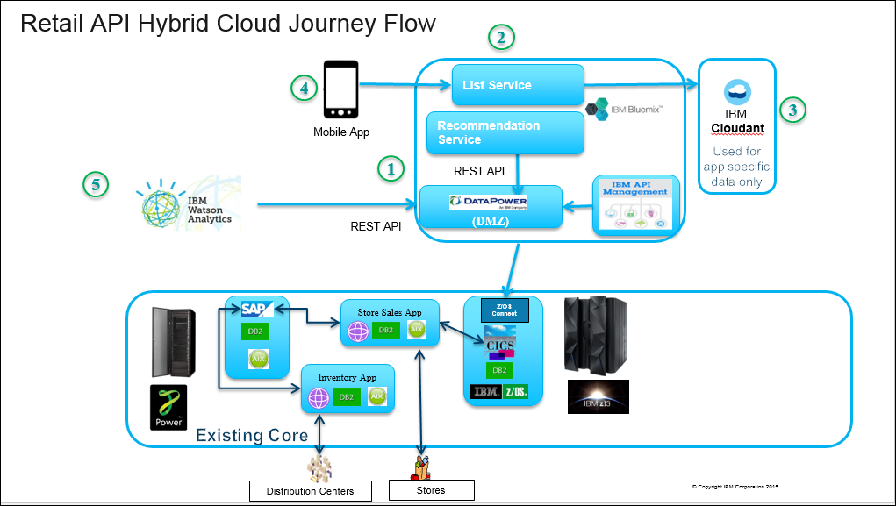

1. Test the Retail REST API on the Developer Portal
2. Create the Virtual Shopping List mobile app and supporting web services in Bluemix
3. Create and populate the mobile app tables in Cloudant
4. Test the Virtual Shopping List mobile app end-to-end
5. Explore customer purchase history data in IBM Watson Analytics

## Included components
  
* [Db2](https://www.ibm.com/analytics/us/en/technology/db2/?lnk=STW_US_SHP_A4_TL&lnk2=learn_DB2)
* [CICS Transaction Server](https://www-01.ibm.com/software/data/enterprise-application-servers/cics/)
* [z/OS Connect Enterprise Edition](https://www.ibm.com/ms-en/marketplace/connect-enterprise-edition) 
* [API Connect](http://www-03.ibm.com/software/products/en/api-connect)
* [Bluemix](https://www.ibm.com/us-en/marketplace/cloud-platform)
* [Cloudant](https://www.ibm.com/analytics/us/en/technology/cloud-data-services/cloudant)
* [Watson Analytics](https://www.ibm.com/analytics/watson-analytics/us-en/)

## Steps

### Part 1. Test the Retail REST API on the Developer Portal
1. [Log in to the Developer API portal and prepare the environment](#log-in-to-the-developer-api-portal-and-prepare-the-environment)
2. [Subscribe to the Breadbox API](#subscribe-to-the-breadbox-api)
3. [Work with the Breadbox API](#work-with-the-breadbox-api)

### Part 2. Create the Virtual Shopping List mobile app and supporting web services in Bluemix
1. [Ensure prerequisites are met](#ensure-prerequisites-are-met)
2. [Log in to Bluemix and prepare the environment](#log-in-to-bluemix-and-prepare-the-environment)
3. [Create three place holder apps in Bluemix Cloud Foundry Database](#create-three-place-holder-apps-in-bluemix-cloud-foundry-database)

### Part 3. Create and populate the mobile app tables in Cloudant
1. [Create and launch the cloudant database service](#create-and-launch-the-cloudant-database-service) 
2. [Create and populate the mobile app tables in Cloudant](#create-and-populate-the-mobile-app-tables-in-cloudant)
3. [Configure and onnect the Virtual Shopping List Cloudant Database](#configure-and-connect-the-virtual-shopping-list-cloudant-database)
4. [Create the VSL app shared secret user defined environmental variable](#create-the-vsl-app-shared-secret-user-defined-environmental-variable)

### Part 4. Test the Virtual Shopping List mobile app end-to-end
1. [Get the sample code from github](#get-the-sample-code-from-github) 
2. [Switch to the actual working code](#switch-to-the-actual-working-code)
3. [Log in to the mobile Virtual Shopping List app](#log-in-to-the-mobile-virtual-shopping-list-app)  
4. [Explore the mobile Virtual Shopping List app](#explore-the-mobile-virtual-shopping-list-app)   

### Part 5. Explore customer purchase history data in IBM Watson Analytics
1. [Gather and format Breadbox customer purchase history](#gather-and-format-breadbox-customer-purchase-history) 
2. [Log in to IBM Watson Analytics](#log-in-to-ibm-watson-analytics)
3. [Upload data](#upload-data)
4. [Generate insight](#generate-insights)

### Part 6. Suggestions for extending this application


# Part 1. Test the Retail REST API on the Developer Portal

Use the API Connect Developer Portal to test the **GET /customerHistory** operation of the Breadbox API.  This operation retrieves customer purchase history and will be used in Part two of this journey.   

## Log in to the Developer API portal and prepare the environment

1. Sign up for an [IBM ID](https://www.ibm.com/account/us-en/signup/register.html) if you don't have one already. This is required for the next step.

2. Go to the [Developer API Portal].

3. Create an account if you have not done do already.

   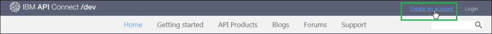
   
   * Click **Create an account**.
   * Provide all required information.  Be sure to use your IBM ID (Email) for this account.
   * Click **Submit**.
   
   An account activation email will be sent to your registered Email. Click on the link in this email to activate your account before. 
   
4. Log in to your account. 

5. Create a new application (work space for this project).  

   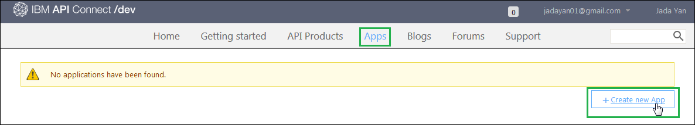
   
   * Click **Apps** from the menu. 
   * Click **Create new app**. 
   * Fill in all required fields. 
   * Click **Submit**.
   
   Make a note of the client ID and client secret. You will need them to access the API later in Part two. 
   
   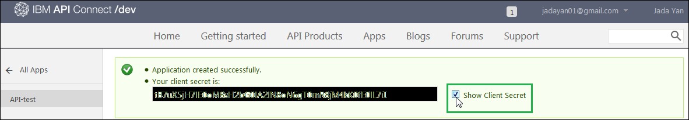
   
## Subscribe to the Breadbox API
     
1. Display a list of available API products.
   
   * Click **API Products** from the top menu.
        
   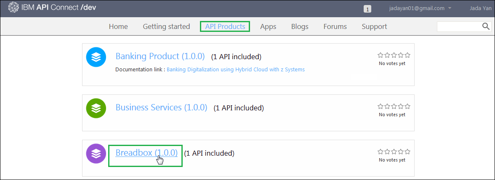
   
2. Select the **Breadbox** product.
  
   * Click **Breadbox**. 
   
   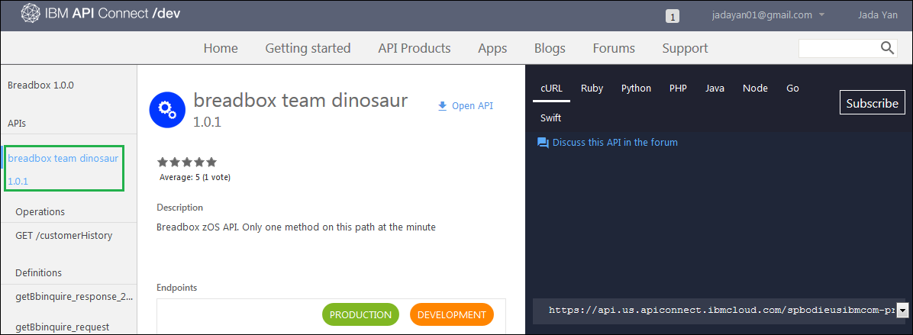
   
   From the left navigation panel, you will see one published API named **breadbox team dinosaur**.

3. In order to work with this API, you must subscribe to it first.

   * Click **Subscribe** for the Default Plan.
   * Select the app that you have just created.
   * Click **Subscribe**
   
   
   
   
## Work with the Breadbox API
   
1. Let's take a closer look at this API. 
   * Click **breadbox team dinosaur**
   
   
   
   This page has 3 sections:
   
   * The left panel is the navigation panel that lists all the available operations and their definitions.
   * The middle panel displays detail information for the item you have selected.
   * The right panel contains sample code in various programming languages.    
  
2. This API has one operation: **GET /customerHistory"**.  

   * Click **GET /customerHistory"**.
    
   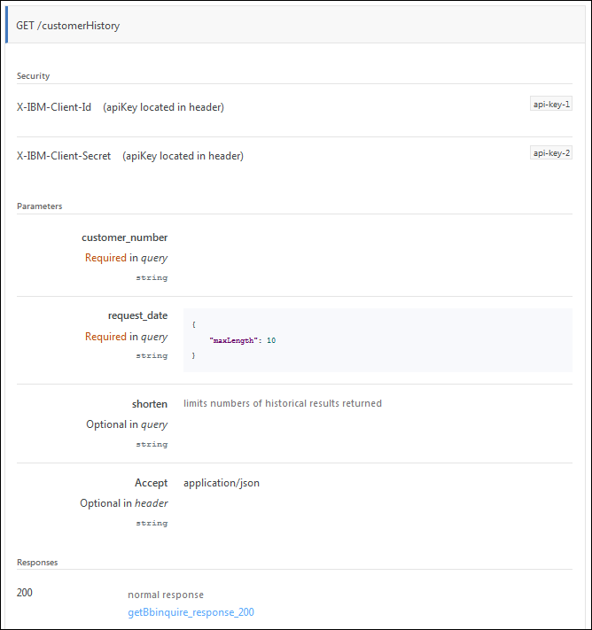
    
   This operation retrieves purchase history for a customer. The required parameters and their formats are described.
  
3. Generate code to test this operation.  Go to the right panel.
   
    * Click a programming language that you want to work with.
    
    
    
    Code example in the selected programming language and an example output of a successful response are displayed.  You can copy the code and use it in your own application. 
    
    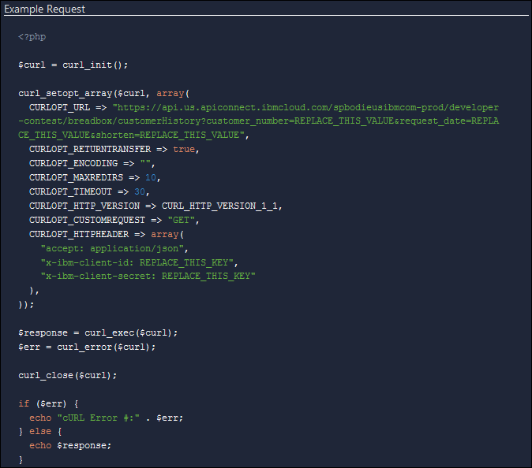
    
4. Test the **GET /customerHistory"** operation with the generated code.    
   
   * Scroll down to **Try this operation** section.  
   
   * Fill in the following:
    
   | Field           | Value                      | Comment                                         |
   | --------------- | -------------------------- | ----------------------------------------------- |
   | Client ID       | ID of the application      | Should be defaulted to the one you just created |
   | Client secret   | Secret for the application | Secret generated when app was created           |       
   | customer\_number| 1000100                    | Valid #s are 1000100-1000140                    |
   | request\_date   | 2013-09-01                 | Purchase history since this date                |
   | shorten         | 2                          | Number of records to retrieve                   |       
       
   * Click **Call operation**.
       
   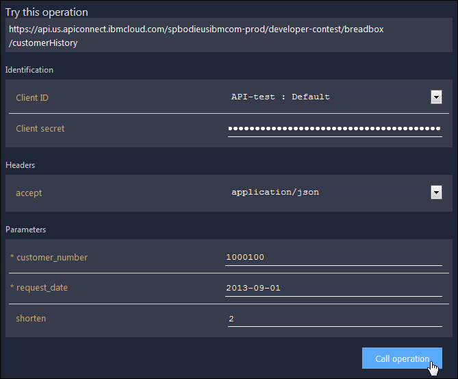
    
   You should see the output returned at the bottom of the page.
    
   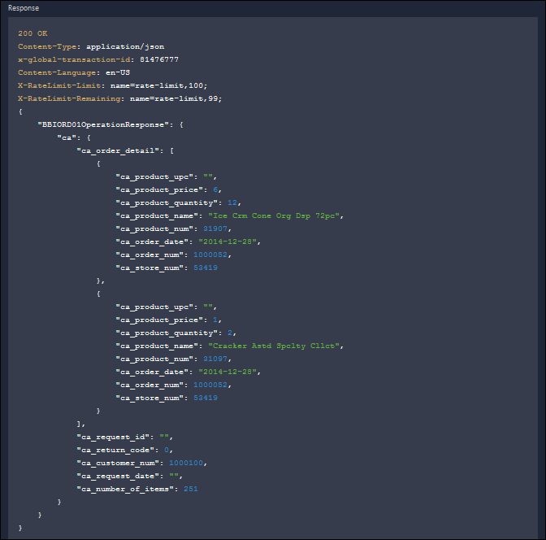

---

:thumbsup: Congrtulations!  You have successfully tested the Breadbox API and ready to move on to part 2 of this journey.

---

# Part 2. Create the Virtual Shopping List mobile app and supporting web services in Bluemix

This section takes you through the steps to install the Breadbox Groceries sample mobile web application and associated web services in IBM Bluemix.  

## Ensure prerequisites are met

1. Complete Part 1 of this journey, [Test the Retail REST API on the Developer Portal](#test-the-retail-rest-api-on-the- developer-portal).

2. If you don't have a Bluemix account, sign up for one [here](https://console.ng.bluemix.net/).

3. Follow the instructions [here](https://clis.ng.bluemix.net/ui/home.html) to install the Bluemix CLI tools. 

## Log in to Bluemix and prepare the environment 

1. Login to your [Bluemix account](https://console.ng.bluemix.net/).

2. Create an organization.
   
   * Select **US South** region. 
   * Enter a name for the organization.      
   * Click **Create**.
 
 
   >Important:  Plese choose the **US South** region.  The development tools used in this section were validated with this region only.
   
   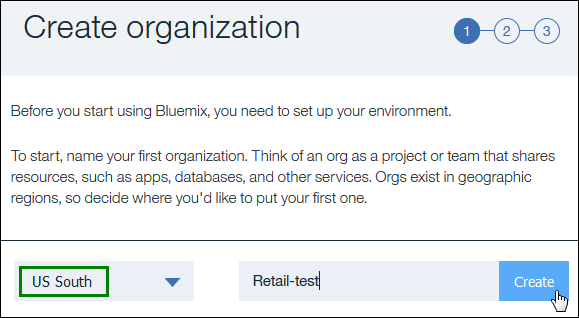
   
3. Create a space. 

   * Enter a name for the space.
   * Click **Create**.
   
   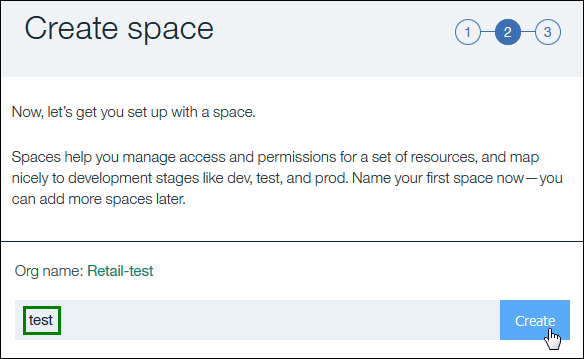
   
4. On the summary page, click **I'm Ready**.
   
   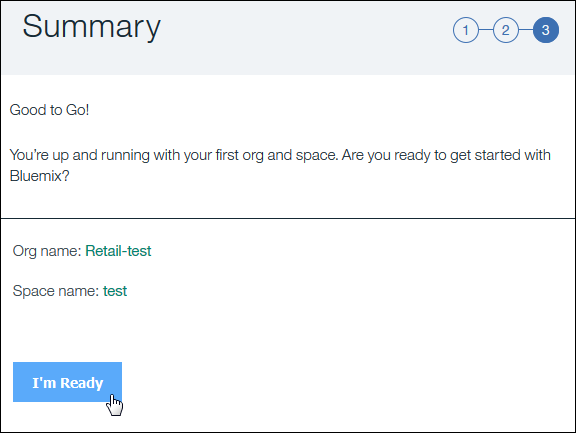
   
## Create three place holder apps in Bluemix Cloud Foundry Database

### Create a new App for the Virtual Shopping List Recommendation Web Service (vslrecws). 

1. From the main Apps dashboard, click **Create App**.   
   
   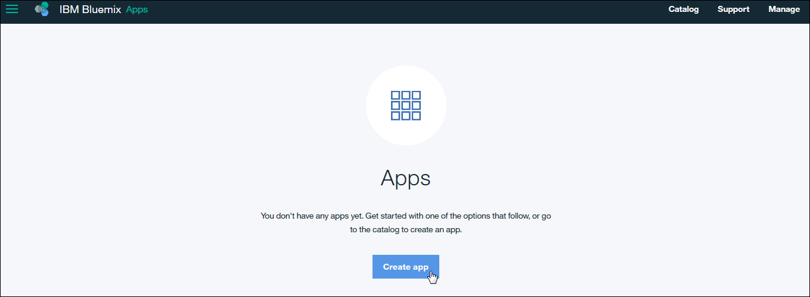
   
2. In the left navigation pane, click **Cloud Foundry Apps**.  
   
3. Select **SDK for Node.js**.
   
   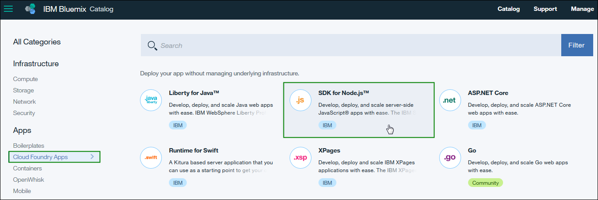
   
4. For App name and Host name, fill in **vslrecws-something-unique**
   
   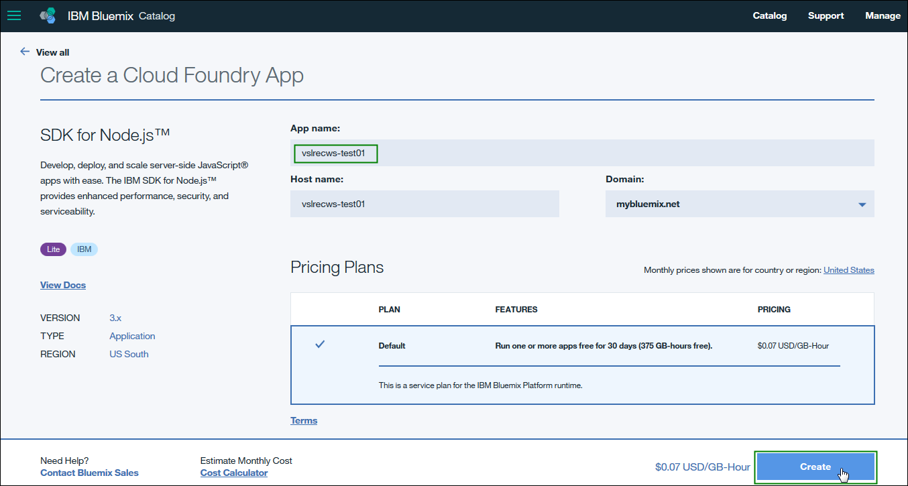
   
   *IMPORTANT:  The Host name must be unique across all of the bluemix.net domain.  Bluemix should enforce this uniqueness, by checking for any prior users, before creating the placeholder Cloud Foundry applications. We recommended that you use the following format, vslrecws-something-unique where something-unique is a sequence number, or project nickname, or developer nickname, etc., such as vslrecws-dev02 or vslrecws-test03.*
   
5. When ready, click **Create**.
   
   The app is now Running!    
   
   
   
6. Click **Visit App URL** to test it.
   
   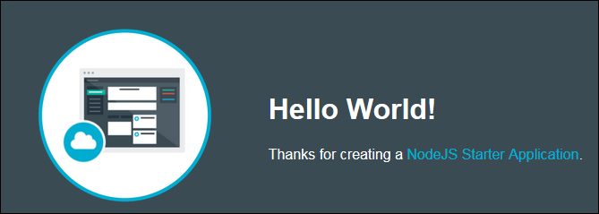
   
   You have just instantiated a simple template Hello world web application.  
   
7. Download the node.js app code. 
   
   1. Click **download the sample code**.        
   2. Save the code to your computer.      
   3. Unzip the file to a directory.
   
8. Go to a terminal and navigate to the sample code directory.
   
9. Authenticate to Bluemix. Enter:
   ```   
   bluemix login –a https://api.ng.bluemix.net
   ```
   Enter your Bluemix account and credentials
   
   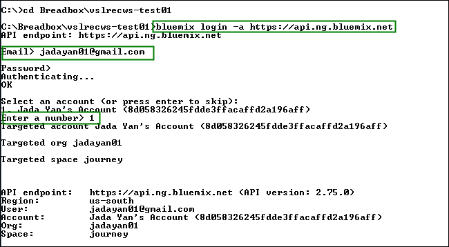
   
10. Push the unchanged code for the sample node.js app we created earlier to Bluemix.
    ```   
    bx app push vslrecws-something-unique 
    ```  
    When processing completes, your app will restart.  You should receive messages similar to the following: 
      
    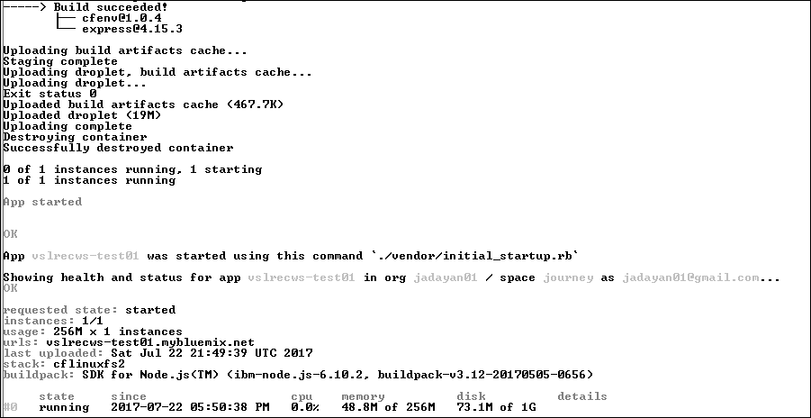
      
11. Return to the Bluemix portal and navigate the the Cloud Foundry Apps. You should see the vslrecws app you just created.
      
12. Click on the route to load the URL into your browser to make sure that the node.js sample app is still healthy.  
   
    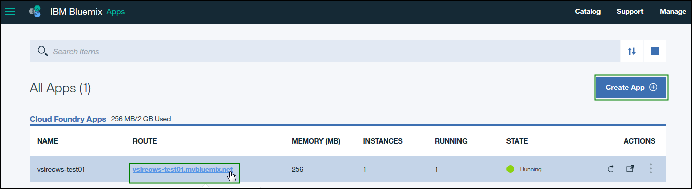

### Create a new App for the Virtual Shopping List Listing Web Service (vsllistws-something-unique) 

1. Repeat the procedures in the previous step to create the Virtual Shopping List Listing Web Service App.

### Create a new App for the Breadbox portal (breadboxportal-something-unique).

1. Repeat the procedures in the previous step to create the Breadbox portal App.

When these steps are complete, you should see these three apps in your Cloud Foundry Apps list.

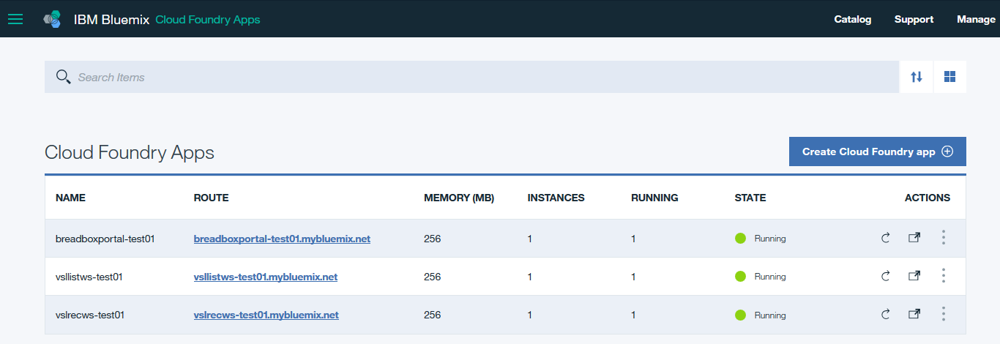

# Part 3. Create and populate the mobile app tables in Cloudant

## Create and launch the Cloudant database service

1. Click **Catalog**, click **Data & Analytics** under the Services section, click **Cloudant NoSQL DB**.
 
   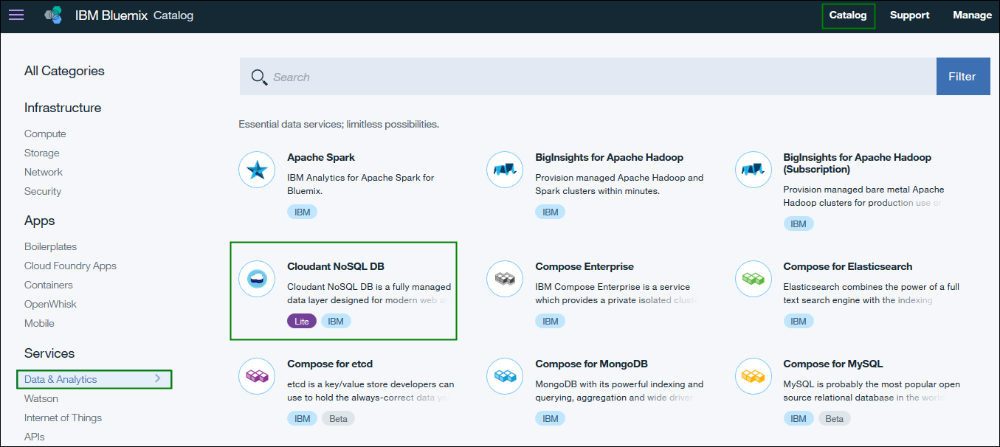
   
2. Change the Service name to: **cloudantconfig**.
   
   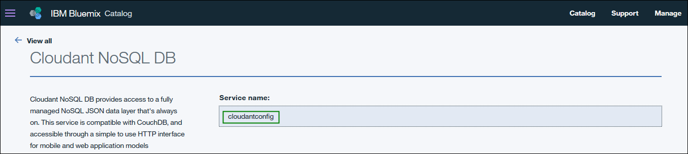
   
   > Important, Service name must be “cloudantconfig”.
   
3. Scroll down to the bottom of the page, accept the default **Lite** PLAN,  Click **Create**.
   
   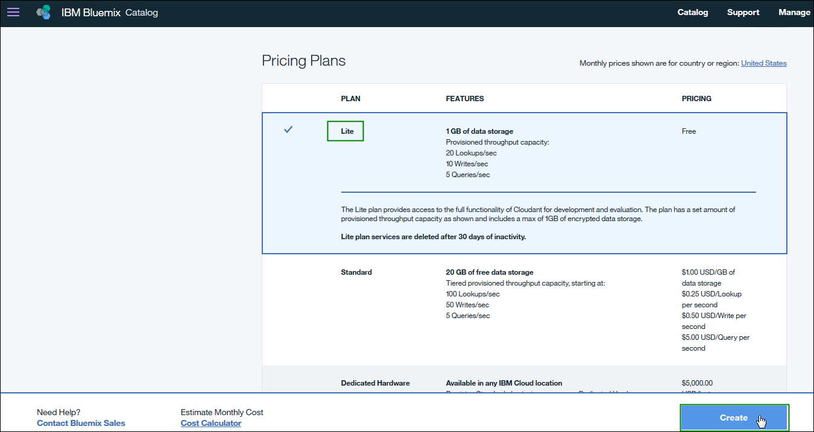
   
   The cloudantconfig instance of the Cloudant NoSQL-DB service is now in place.
   
   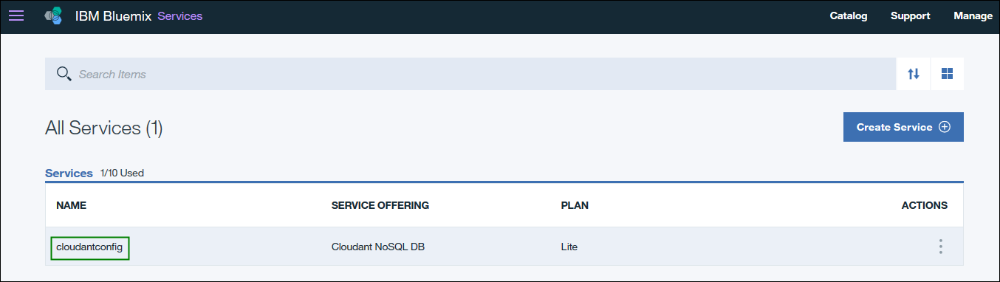

4. Select **cloudantconfig** from the Services list. 

5. Click **Launch** from the Manage tab.
   
   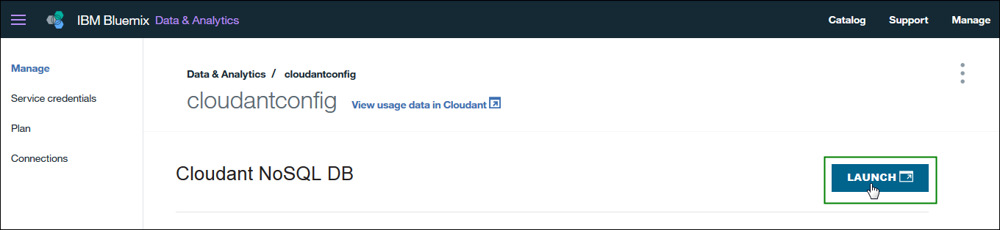
   
   The Cloudant dashboard opens in a separate browser tab.
      
## Create and populate the mobile app tables in Cloudant

1. Create the **rec** database. This database holds purchase recommendations, based on customer purchase history.
 
   1. From the **Database** tab, click **Create Database**.
   
      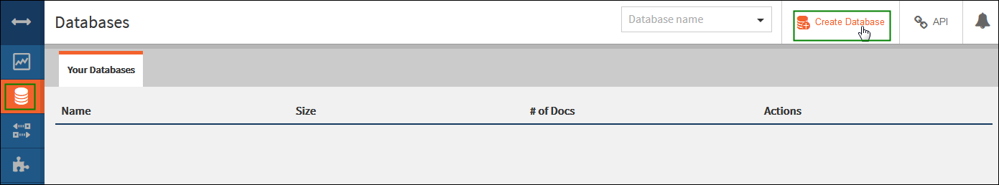
   
   2. Enter a database name of **rec** (short for recommendation)
   
   3. Click **Create**.
   
      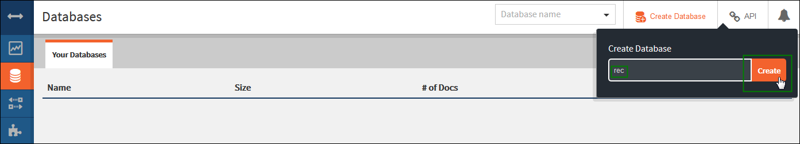
   
2. Create the **users** database. This database stores basic user information and breadpoints.

   1. From the **Database** tab, click **Create Database**.

   2. Enter a database name of **users**.

   3. Click **Create**.

3. Create the **vsl** database. This database holds shopping list items the user manually adds to their list.   

   1. From the **Database** tab, click **Create Database**.

   2. Enter a database name of **vsl**.

   3. Click **Create**.

4. You should now have 3 entries in **Your Databases** tab.
   
   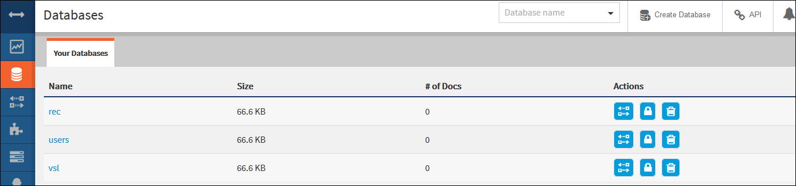

5. Populate a user in the users database.

   1. Click the **users** database.

   2. Click **All Documents (+)**, select **New Doc**.

      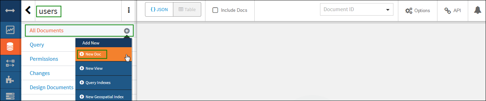

   3. Copy/paste the sample text below over the existing text:
   ``` 
   {
     "_id": "074",
     "customerid": 1000114,
     "ibmid": "jessejes@example.com",
     "breadpoints": 10,
     "realname": "Jesse JES"
   }
   ```
   
      

      * \_id should be between “001” and “100”.
      * customerid should be between 1000100 and 1000140 (inclusive: 1000100 and 1000140 are valid). 
      * ibmid should be a valid email address.  
      * breadpoints should be a valid number.

   4. When finished, click **Create Document**.

   The new user is now in place.
   
   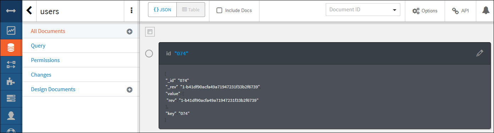
   
## Configure and connect the Virtual Shopping List cloudant database
   
1. Create Cloudant Credentials to use in the Breadbox VSL app.

   1. Back to the Bluemix portal, Click **Service credentials** in the left navigation pane, and click **New credential**.

      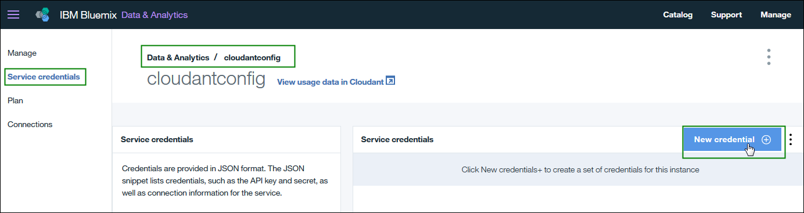
   
   2. Provide a name for the credentials, click **Add**.

      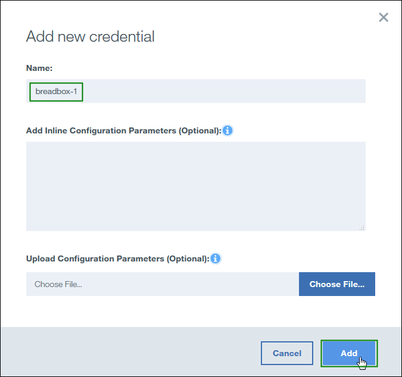
   
      The credential is now in place.
   
      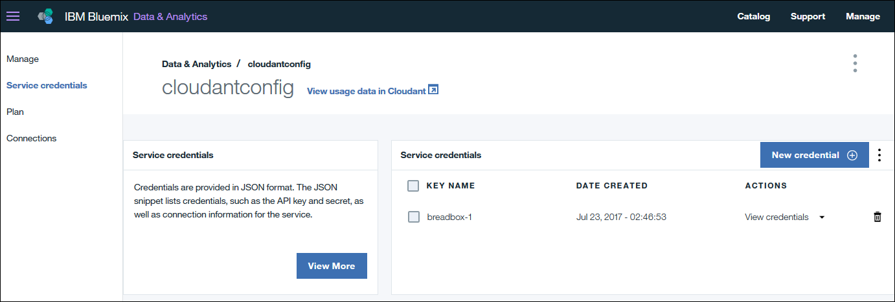

   3. You can use the **View credentials** Action to view the assigned credential.  These will be used later.

      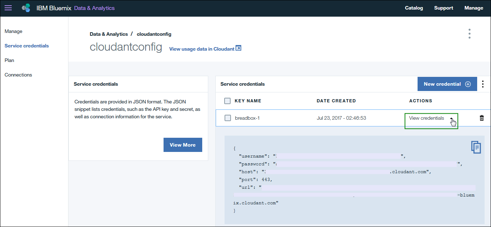

2. Connect Cloudant Credentials to the **Breadbox portal** app.

   1. Click **Connections** in the left navigation pane, and click **Create connection**.

      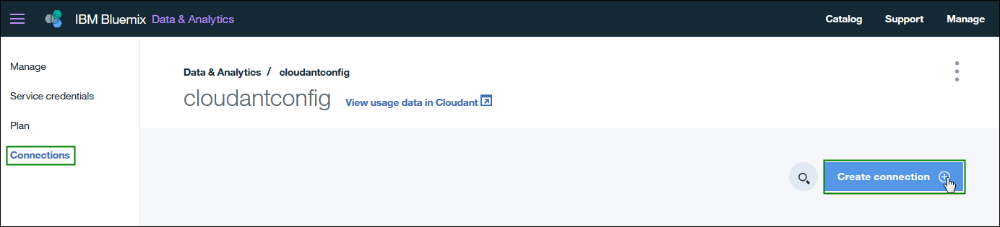
   
   2. Select the **breadboxportal app**, and click **Connect**.

      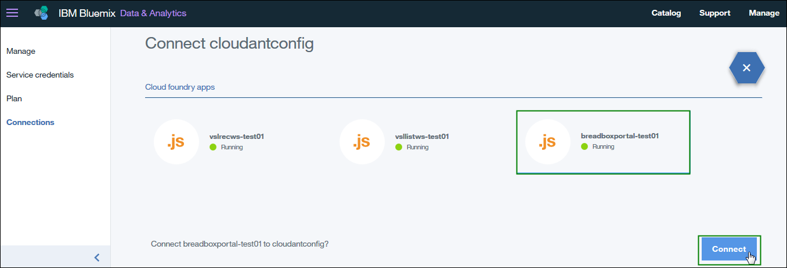

   3. Click on the Restage button.

      

      The Cloudant NoSQL DB service is now connected to the breadboxportal app.
   
      

3. Connect Cloudant Credentials to the **vsllistws** app. 

   1. Repeat the procedures from the previous step.	

4. Connect Cloudant Credentials to the **vslrecws** app.
   
   1. Repeat the procedures from the previous step. 
   
      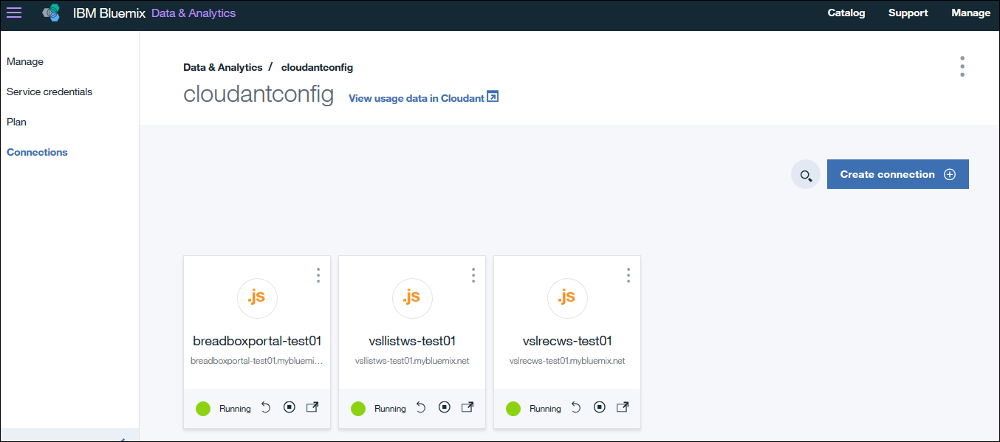
   
5. To see the results of this new Connection (for example, Breadbox portal app):

   * Click **Breadboxportal** conection.  
   
   * Click **Runtime** tab in the left navigation pane, and click ** Environmental variables** in the center selector.
   
   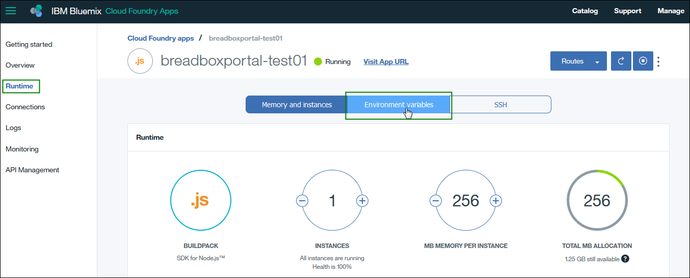
      
   We see the cloudantNoSQLDB environment variable that will be passed to the breadboxportal Cloud Foundary application, so that credentials don’t need to be in the code.  It’s a little odd that the VCAP_SERVICE environment variable above isn’t cloudantconfig, to match the service name, but it works somehow.  ;-) 
   
   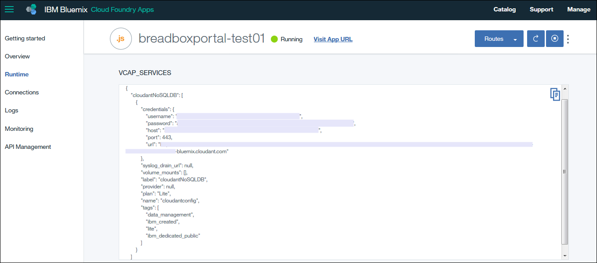

## Create the VSL app shared secret user defined environmental variable 

The environmental variable **JWT_SHARED_SECRET** needs to be identical across breadboxportal, vsllistws, and vslrecws.  This shared secret is used to encrypt and decrypt the JSON web token (JWT) passed between breadboxportal, vslistws and vslrecws.

1. Create the shared secret user defined environmental variable for the breadboxportal app.

   1. Navigate to **Bluemix** / **Cloud Foundry Apps** / **Breadbox portal App**.
   
   2. Click **Runtime** in the left navigation pane.
   
   3. Click **Environmental variables** in the center selector.
   
      
   
   4. Scroll down to the **User defined** section,  Click ** Add**. 
   
      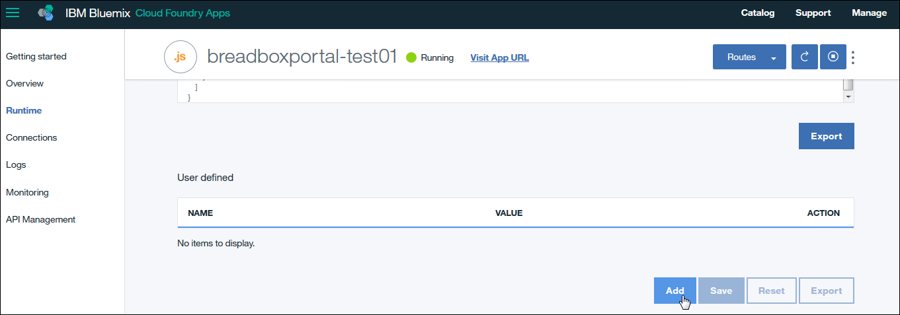
   
   5. Create a new user-defined environmental variable.  Enter:
   
      * Name: **JWT_SHARED_SECRET**  (must be uppercase). 
      * Value: **{"secret": "20-character-random-string"}** where 20-character-random-string can contain upper, lower case characters and numbers.
    
   6. click **Save**.
 
      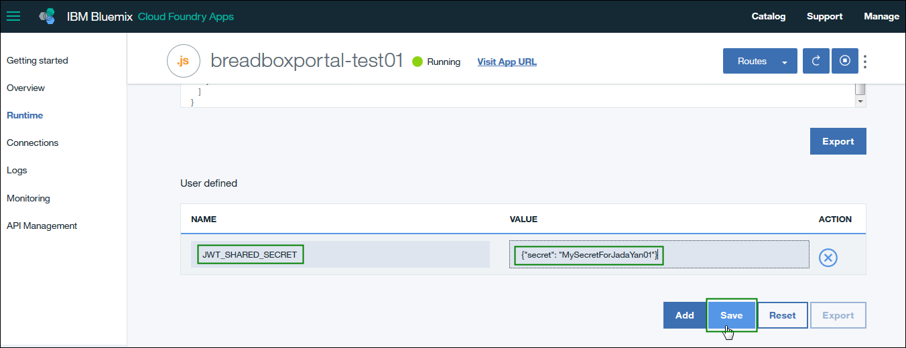
   
      The app will be restarted automatically. 
  
2. Create the shared secret user defined environmental variable for the vsllistws app.

   * Repeat procedures from the previous step. 
   
3. Create the shared secret user defined environmental variable for the vslrecws app.  
   
   * Repeat procedures from the previous step. 
  
# Part 4. Test the Virtual Shopping List mobile app end-to-end
	 
In this section, you are going to upload the actual working code, to overlay the placeholders created earlier. Before proceeding, you must modify a few files to match your specific environment.  

## Get the sample code from github
 
1. In a terminal on your computer, move to the home directory. 
   ```
   cd $HOME 
   ```
2. If not already installed, [install Git](https://git-scm.com/book/en/v2/Getting-Started-Installing-Git_) for your computer. 

3. Once Git is installed, run the following command to clone the needed materials for this exercise. 
   ```
   git clone https://github.com/IBM/increase-retail-revenues-leveraging-hybrid-cloud-on-mainframes.git
   ``` 
4. To find the files you need: 
   ```
   cd increase-retail-revenues-leveraging-hybrid-cloud-on-mainframes/vsl
   ls
   ```
   You should see 3 directories:
      * breadboxportal
      * vsllistws
      * vslrecws

## Switch to the actual working code	 

1. Modify files in the breadboxportal directory.

   1. Move to the **breadboxportal** directory.
      ```
      cd breadboxportal
      ``` 
   2. Edit the **manifest.yml** file.  Replace the **host:** parameter with the URL (route) for your breadbox portal app.  
   
      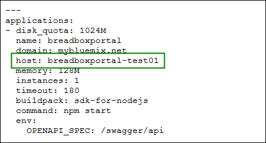
   
   3. Edit the **server.js** file. Replace the **listservice** parameter with URL (route) for your vsl listing web service app.  
   
      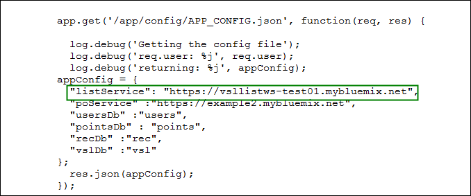
   
2. Modify files in the vsllistws directory.
   
   1. Move to the **vsllistws** directory.
      ```
      cd breadboxportal 
      ```
   2. Edit the **manifest.yml** file. Replace the **host:** parameter with the URL (route) for your breadbox portal app.  
   
      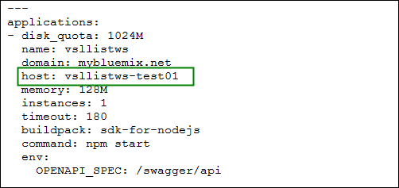
   
   3. Edit the **server.js** file. Replace the **var recsServer** parameter with the URL (route) for your vsl listing web service app.  
   
      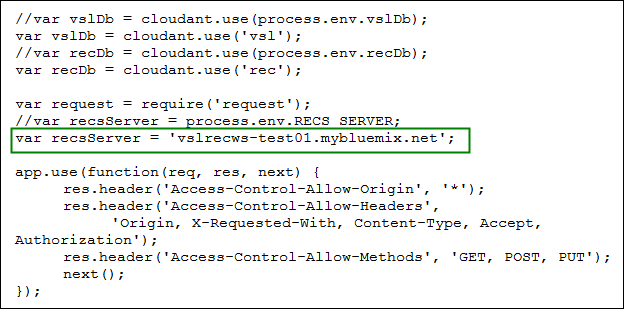

3. Modify files in the vslrecws directory.

   1. Move to the **vslrecws** directory.
      ```
      cd vslrecws 
      ```
   2. Edit the **manifest.yml** file. * Replace the **host:** parameter with the URL (route) for your vsl recommendations web service app.  
   
      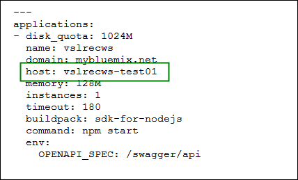
      
   3. Edit the **server.js** file.  
      ```
      Find the section that calls **analyze-history**.
      Replace the value for **'x-ibm-client-id'** with the one you created in Part 1.
      Relace the value for **'x-ibm-client-secret'** with the one you per created in Part 1.
     ```
      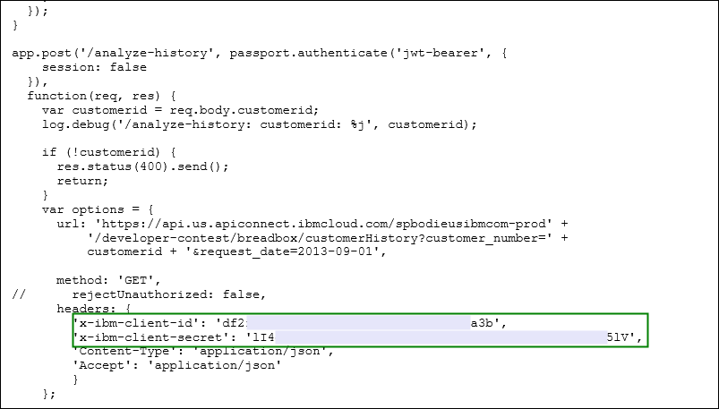
     
4. Authenticate to Bluemix, enter:
   ```
   bluemix login –a https://api.ng.bluemix.net
   ```
   
5. Upload the actual working code and overlaid the placholder for your breadbox portal app.
   
   1. Navigate to the breadboxportal directory.
   
   2. Push the code to Bluemix.  Enter: 
      ```
      bx app push breadboxportal-something-unique
      ```     
      The following shows an example of a successful run.
      
      
      
7. Upload the actual working code and overlaid the placholder for your vsl listing web service app.
   
   1. Navigate to the vsllistws directory.
   
   2. Push the code to Bluemix.  Enter:
      ```
      bx app push vsllistws-something-unique
      ```
     
8. Upload the actual working code and overlaid the placholder for your vsl recommendation web service app.
   
   1. Navigate to the vslrecws directory.
   
   2. Push the code to Bluemix. Enter:
      ```
      bx app push vslrecws-something-unique
      ```   
> IMPORTANT:  When issuing the bx cf push commands, its very important to issue the commands for a given application from within the directory for that application.  If this is not done, application hosts get cross wired, and your applications will start to be unreachable intermittently, as Bluemix seems to associate multiple routes with the same application, when a cross wired push is done.  If cross wiring occurs, the Bluemix portal can be used to edit the application routes, and delete unintended routes.  Use the Routes button in the upper left corner of any detailed views (Overview, Runtime, Logs, etc.) for the application.
 
9. As a quick check for proof that the actual working Breadbox Recommendation Service is running.  
   
   1. Click on the URL for the vslrecws app.
   
      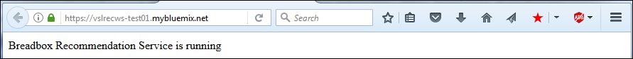

## Log in to the mobile Virtual Shopping List app

Now we are ready to see the final result, the full hybrid cloud application from Bluemix all the way back to z/OS Connect.
 
1. Navigate to the breadboxportal app in Bluemix.  

2. Click the **Route** host you created before for the breadboxportal app.

   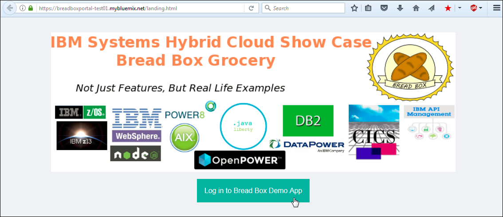

3. Click the Login button at the bottom of the screen above. 

   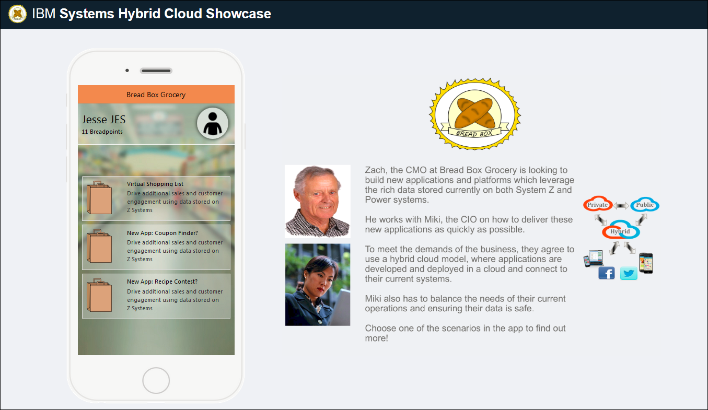

   This sample portal, mobile application lacks user login.  Developers may choose to add user login themselves.  The sample redirects directly to the mobile application screen.  

## Explore the mobile Virtual Shopping List app

1. Select the Virtual Shopping List app on the mobile phone.

   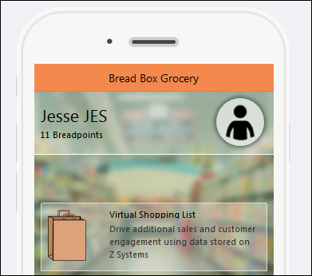

   The top two rows are recommendations coming from the Recommendation web service based on the customer purchase history coming from z/OS Connect!
    
   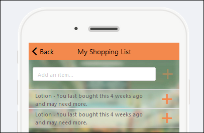
  
2. You can use the plus (+) sign to add recommendations to your shopping list.  The shopping list is persisted in the cloud, in the Cloudant database.

   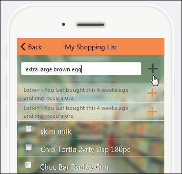

3. To get further validation that our integration of the engaging mobile app in the cloud, with the customer purchase history on IBM Z, you can double check the Recommendation web service log in Bluemix to see the recommendations coming from the analyze-history call. 

   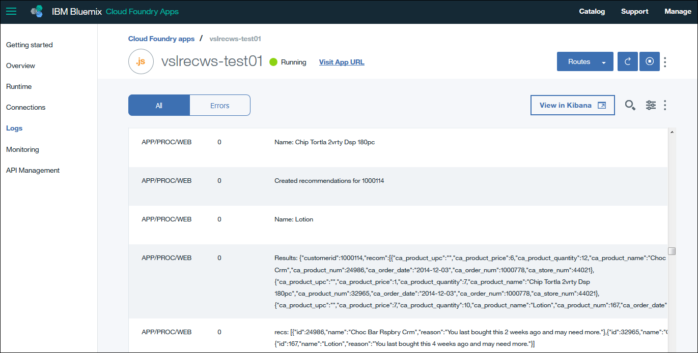

4. We can also see the raw response from the API on the Developer Portal.

   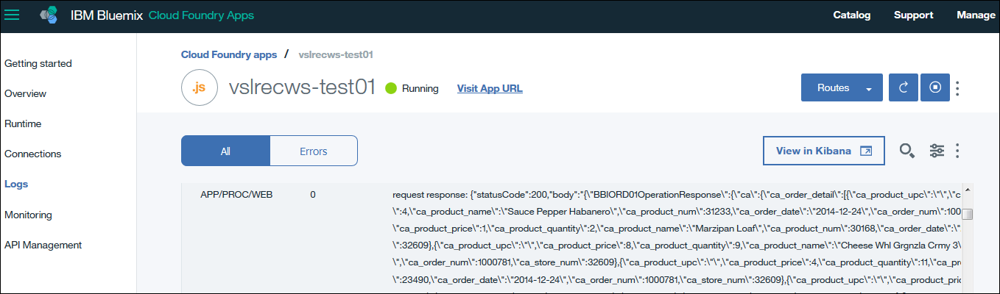

5. The cloudant "users" “rec” and “vsl” databases are self-priming, based on use of the portal, mobile app.  Using the Cloudant management UI, we can the databases are working properly. Navigate back to the Cloud management UI, and navigate to the Databases view.  

   1. Select the **users** table. Click the pencil in the upper right to view/edit the document.
 
      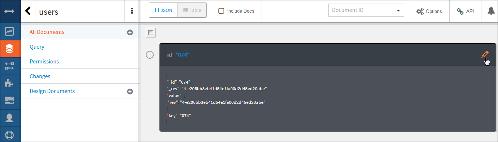
  
      Jesse now has 12 breadpoints!

   2. Select the **rec** table. Click the pencil in the upper right to view/edit the document. Similarly, the recommendations for Jesse JES (_id=1000114) are in this database.

      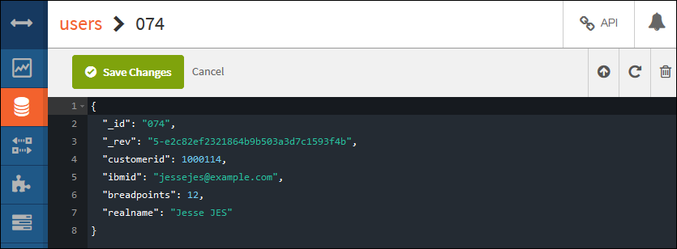
    
   3. Select the **vsl** table. Click the pencil in the upper right to view/edit the document. The items that Jesse JES added manually to his virtual shopping list is now in this database.

      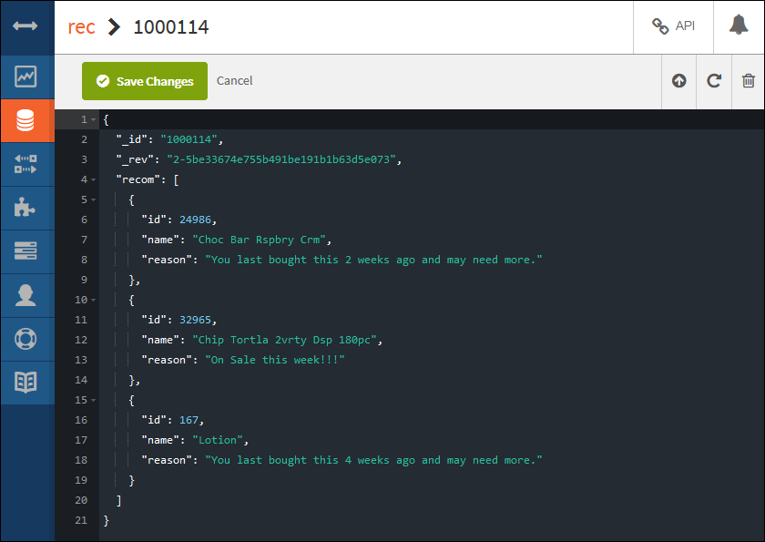
      
---

:thumbsup: Congratulations!  You have successfully completed deployment of the Virtual Shopping List web application. 

---

# Part 5. IBM Watson Analytics on Breadbox Customer Purchase History

In this section, you will explore and gain insights from Breadbox Groceries customer purchase history. This data exploration can have immense business value, looking for trends, such as products selling well, not so well, for specific customers, trends in customer retention, customer purchase volume per visit, customer visits to more than one store – the possibilities are endless.  Armed with insights, Breadbox Groceries might use the Virtual Shopping List mobile application to insert promotions to target customers, that might improve number of visits, quantity of purchases per visit, etc.  After the promotion period, the results can be measured by further analytics on customer purchase history.  In this section, we’ll use the API we created, to gather customer purchase history for various customers, feed that information into IBM Watson Analytics, running in the IBM Cloud, to see what types of insights are possible.

## Gather and format Breadbox customer purchase history
 
In the first Experience, we saw that the customerHistory API returns a large json document.  The API returns data for a single customer.  One tricky part is that IBM Watson Analytics doesn’t process json, so you will have to convert the API json response to CSV format. 

There is a prepared CSV file **result.csv** which contains purchase history for customer 1000100. You can find it in the files you downladed earlier from github.   

```
ls increase-retail-revenues-leveraging-hybrid-cloud-on-mainframes/result.csv
```

*If you prefer to use this file, please skip this section and proceed to [5.2. Log in to IBM Watson Analytics](5.2.-log-in-to- IBM-Watson-Analytics) 

1. Retrieve customer history for a customer.

   There are a number of tools, techniques to do an API request.  Using curl is shown here.

   ``` 
   curl --request GET \
     --url 'https://api.us.apiconnect.ibmcloud.com/spbodieusibmcom-prod/developer-contest/breadbox /customerHistory?customer_number=1000100&request_date=2013-09-01' \
     --header 'accept: application/json' \
     --header 'x-ibm-client-id: df2fecbf-01f5-41ed-90c0-2b8883db2a3b' \
     --header 'x-ibm-client-secret: -----------------------------------------'
   ```
   
2. Convert results from json to csv format.

   There are several ways to convert json to csv.  In this example, a json2csv node module was used, found at: https://github.com/zemirco/json2csv#command-line-interface

   Here is a sample session to convert json to csv at the command line, using the node module json2csv.  

   >IMPORTANT:  One slightly hidden step is to trim the json response to only the details portion of the response (ca_order_detail), the main part of the response, the long array of strings, between the square brackets:  [  … ].  The vi editor is used to remove the front and back matter, to leave the square brackets and everything in between.  
   
   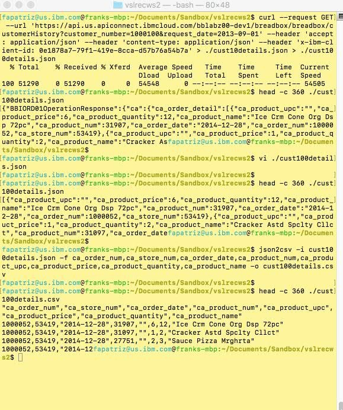
   
## Log in to IBM Watson Analytics 

1. Log in to [IBM Watson Analytics](https://www.ibm.com/analytics/watson-analytics/us-en/).

2. Use your IBMid to log in. You will have to sign up for a free trial if you have not done so already.

   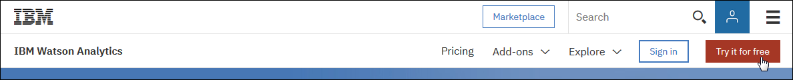

   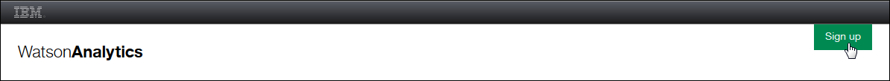
   
## Upload data 

1. Click New data in the upper left.

   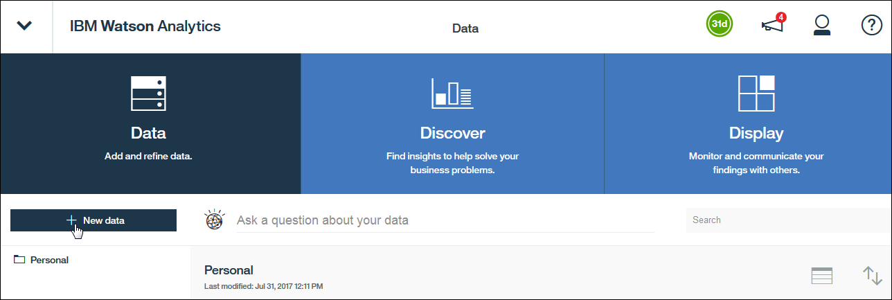

2. Click Local file and click Browse.

   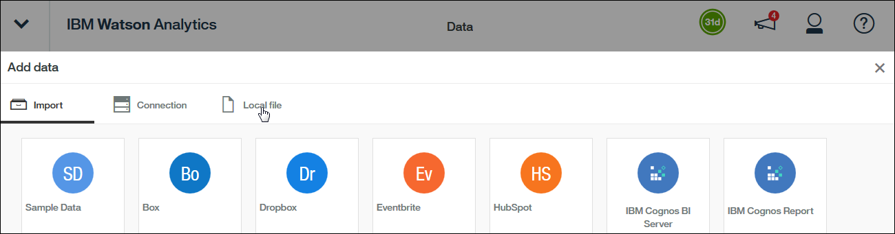

   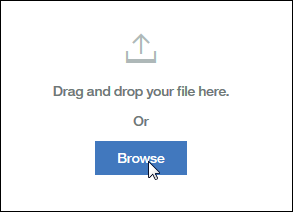
 
3. Select your .csv file using your OS file chooser.

4. Click Import in the bottom left.

   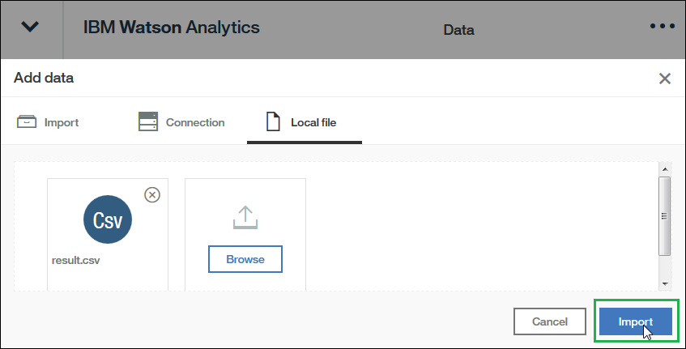
 
5. Click the tile for the .csv file just uploaded.

   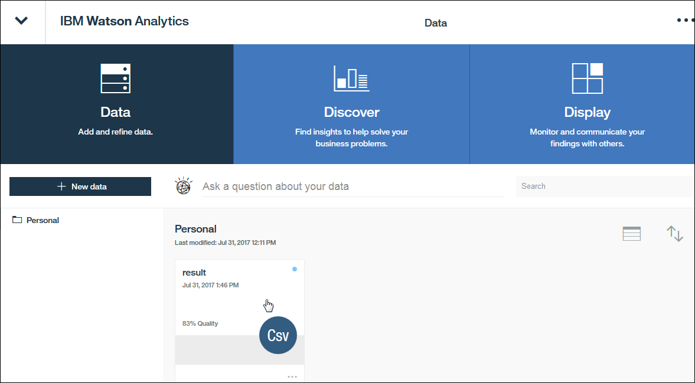
 
 
## Generate Insights

Various Starting points are shown.  You can begin your data exploration, trying out various things you see, and see what you can come up with.
 
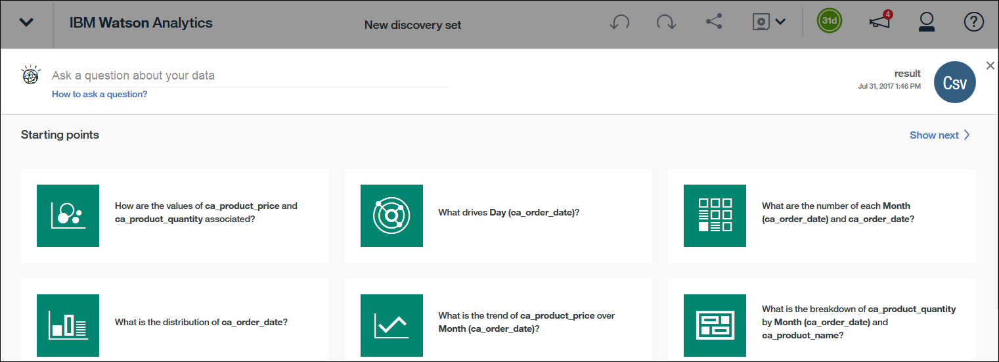
 
Here are a few examples:

1. This customer really likes Honeyed Preserve.

   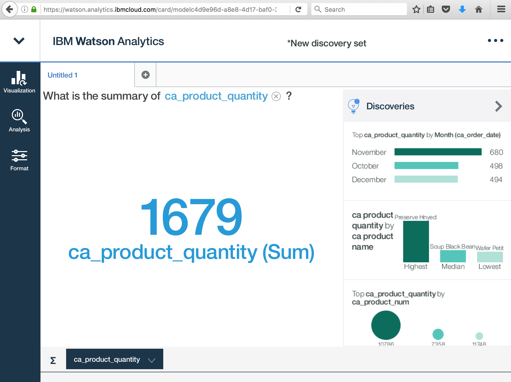
 
2. This customer buys mostly in Store 4 and 5, and really likes Tea Lemon Ginger.

   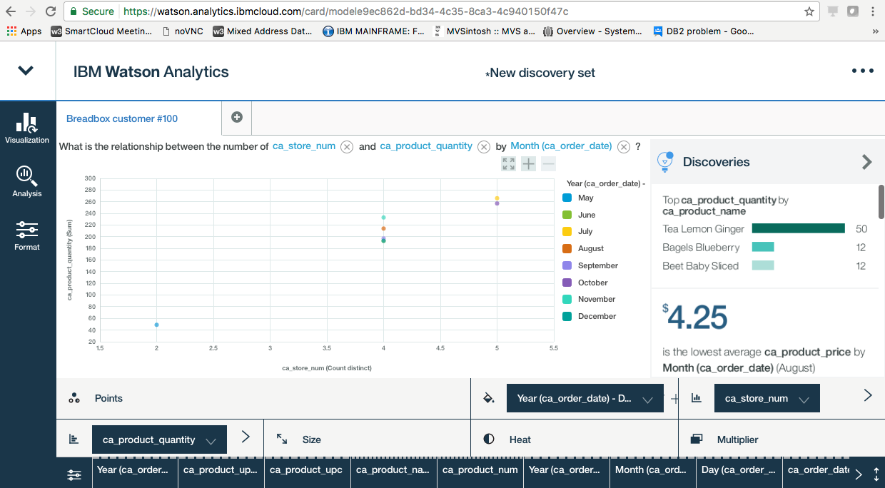

3. This customer is spending more lately  ;-)

   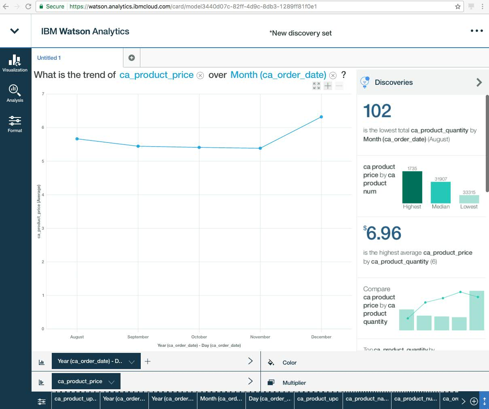
 
  

# Part 6. Suggestions for extending this application

The purpose for this sample app is a starting point for additional “hacks” that can be done. Here are some ideas on possible hacks:

1. Convert to a fully mobile optimized web application – a full phone/tablet web app.
2. Add Google or Facebook authentication
3. Add contests, reward programs
4. Improve the recommendation engine: better algorithms, consider other facts like day of the week, season, location, drive coupons, specials to the user
5. Analytics on customer purchase history to find, track customer retention issues, etc.


[Sample code github repository]: https://github.com/IBM/Increasing-retail-store-revenues-leveraging-zSystem-hybrid-cloud/tree/master/Sample%20code

