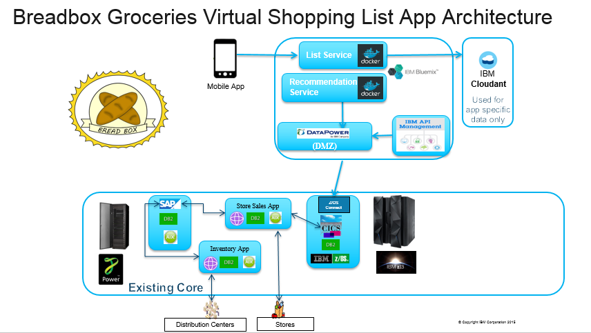

# Increasing retail store revenues using IBM Z hybrid cloud

To showcase the business challenges that a typical retail company might be experiencing, we share a case study about a fictitious retail company, which we refer to as **Breadbox Groceries**.  

Today, they run three data centers across the country with IT reaching into the stores and distribution centers as well.  In the data centers, they host their core Business Support Systems on IBM Z. Supporting applications are hosted on IBM CICS® and IBM z/OS® Db2 systems.

One of the initiative for Breadbox was to implement the **virtual shopping list**. With this app, customers will be reminded that they need milk at the store the next time they go based on the purchasing history. Bluemix was chosen as the platform to build this application because of its easy to use platform with integration technologies for connecting to on-premises systems of record.

A REST API was created, reusing proven programs running in CICS, to get the data needed to provide recommendations to customers. The API was published to Bluemix, making it availabe for the new application to consume it.

## Scenarios

**Scenario one: GET /customerHistory API** - Use Developer Portal Generate code and use this API to retrive a customer's purchase history.   
**Scenario two: Virtual shopping list** - Deploy this mobile application from Bluemix.

## Architecture

## Included components
  
* [IBM z Systems Mainframe] ([IBM z Systems Mainframe Redbook] & [IBM z Systems Mainframe developerWorks])
* [IBM z/OS] ([IBM z/OS Knowledge Center])
* [IBM CICS Transaction Server] ([IBM CICS TS Knowledge Center] & [IBM CICS TS developerWorks])
* [IBM z/OS Connect Enterprise Edition] ([IBM z/OS Connect EE Knowledge Center] & [IBM z/OS Connect EE developerWorks])
* [IBM Db2] ([IBM Db2 Knowledge Center])
* [IBM Bluemix]
* [IBM API Connect] ([IBM API Connect Knowledge Center] & [IBM API Connect developerWorks])
* [IBM Secure Gateway Service]
* [IBM Cloudant]

# Scenario one: GET /customerHistory API

Generate code and use this API to retrive a customer's purchase history.

1. Sign up for an [IBM ID] if you don't have one already. This is required for the next step.

2. Go to the [IBM Developer Portal] 
3. Create an create if you have not done do already.
   * Click **Create an account**
   * Fill out the information.  Be sure to use your IBM ID for this account.
   * Once the request is submitted, You will receive an account activation email. You need to click on the link in this email to activate your account before you can login. 
   
4. Login to your account. 

5. First, you must create a new application (your work space for this project).     
   * Click **Apps** from the menu. 
   * Click **Create new app**. 
   * Fill in all required fields. 
   * Click **Submit**.
   
   Now that you have registered your app, you can browse the available APIs and subscribe. Make a note of your client ID and client secret. These may be needed for your application to access the API. 
     
6. Click **API Products** from the top menu. 
A list of available products is displayed. You will be working with **Breadbox**.

7. Click **Breadbox** product to see the details. 
From the left navigation panel, you will see a list of published APIs. In this case, there is one API called **breadbox team dinosaur**.

8. Click **Subscribe** for the Default Plan to subscribe to this Breadbox product.
   * Select the app that you have just created.
   * Click **Subscribe**

9. Click **breadbox team dinosaur** to see details about this API. This page has 3 sections:
   * The left panel is the navigation panel that lists all the available operations and their definitions.
   * The middle panel displays detail information for the item you have selected.
   * The right panel contains sample code in various programming languages.  You can test each API operation using your favorite language.  
  
9. This API has one operation **GET /customerHistory"**.  Let's look at it closely. 
   * Click **GET /customerHistory"**.
   This operation retrieves purchase history for a customer. The required parameters and their formats are described: **customer_number** and **request_date**.
  
10. Next, go to the right panel and test this API.
     * Click a programming language to work with. 
     Code example in the selected programming language is displayed.  You can copy it and use it in your own application. An example output of a successful response is also included.
     * Scroll down to **Try this operation** section.  Fill in the following:
        
        **Client ID**: ID of the application.  Should be defaulted to the one you just created.
        
        **Client secret**: The secret key for ths application.
        
        **customer_number**: 1000100
        
        **request_date**: 2013-09-01
        
        **shorten**: 2 (limit to 2 records retrieved)
     
     * Click **Call operation**.
    
    You should see the output returned at the bottom of the page.  

# Scenario two: Deploy Virtual Shopping List application

1. Sign up for a Bluemix account, if you don't have one already.

2. Sign up 

[IBM Digital Transformation Model]: https://developer.ibm.com/mainframe/ibm-digital-transformation/

[IBM Bluemix]: https://www.ibm.com/us-en/marketplace/cloud-platform
[IBM z Systems Mainframe]: https://www-03.ibm.com/systems/z/
[IBM Client Center Montpellier]: https://www.ibm.com/ibm/clientcenter/montpellier/

[IBM z Systems Mainframe Redbook]: https://www.redbooks.ibm.com/redbooks.nsf/pages/z13?Open
[IBM z Systems Mainframe developerWorks]: https://developer.ibm.com/mainframe/

[IBM z/OS]: https://www-03.ibm.com/systems/z/os/zos/
[IBM z/OS Knowledge Center]: https://www.ibm.com/support/knowledgecenter/en/SSLTBW

[IBM CICS Transaction Server]: https://www-01.ibm.com/software/data/enterprise-application-servers/cics/
[IBM CICS TS Knowledge Center]: https://www.ibm.com/support/knowledgecenter/en/SSGMGV
[IBM CICS TS developerWorks]: https://developer.ibm.com/cics/

[IBM z/OS Connect Enterprise Edition]: https://www.ibm.com/ms-en/marketplace/connect-enterprise-edition
[IBM z/OS Connect EE Knowledge Center]: https://www.ibm.com/support/knowledgecenter/en/SS4SVW
[IBM z/OS Connect EE developerWorks]: https://developer.ibm.com/mainframe/products/zosconnect/

[IBM Db2]: https://www.ibm.com/analytics/us/en/technology/db2/?lnk=STW_US_SHP_A4_TL&lnk2=learn_DB2
[IBM Db2 Knowledge Center]: https://www.ibm.com/support/knowledgecenter/en/SSEPEK/db2z_prodhome.html

[IBM Master Data Management]: https://www.ibm.com/analytics/us/en/technology/master-data-management/
[IBM Master Data Management Knowledge Center]: https://www.ibm.com/support/knowledgecenter/en/SSWSR9

[IBM API Connect]: http://www-03.ibm.com/software/products/en/api-connect
[IBM API Connect Knowledge Center]: https://www.ibm.com/support/knowledgecenter/en/SSMNED 
[IBM API Connect developerWorks]: https://developer.ibm.com/apiconnect/

[IBM Secure Gateway Service]: https://console.bluemix.net/docs/services/SecureGateway/secure_gateway.html

[IBM DataPower Gateway]: http://www-03.ibm.com/software/products/en/datapower-gateway

[IBM DataPower Gateway Knowledge Center]: https://www.ibm.com/support/knowledgecenter/en/SS9H2Y 

[IBM ID]: https://www.ibm.com/account/us-en/signup/register.html
[IBM Developer Portal]: https://developer-contest-spbodieusibmcom-prod.developer.us.apiconnect.ibmcloud.com/

[Sign up or log in to IBM Bluemix]: https://console.bluemix.net/registration/?

[IBM Cloudant]: https://www.ibm.com/analytics/us/en/technology/cloud-data-services/cloudant

